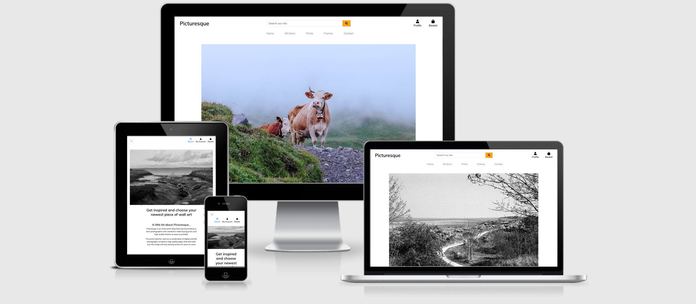
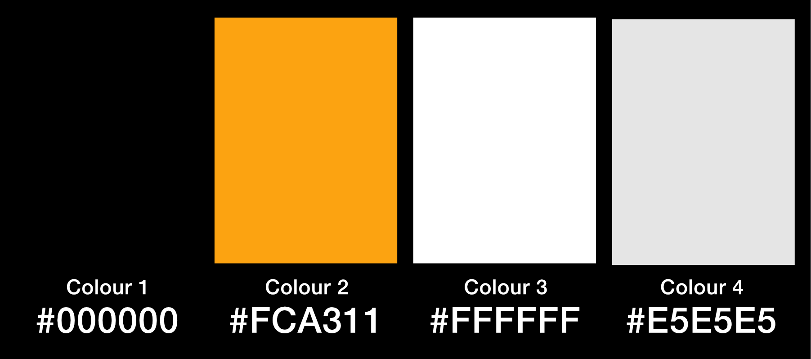

[View the deployed site here]('https://picturesque-ms4.herokuapp.com/')

## Table of Contents

- [Project Goals](#project-goals)
- [User Experience](#user-experience)
    - [User Goals](#user-goals)
    - [Target Audience](#target-audience)
    - [User Stories](#user-stories)
    - [User Requirments and Expectations](user-requirements-and-expectations)
    - [Scope](#scope)
    - [Structure](#structure)
- [Design Choices](#design-choices)
    - [Colours](#colours)
    - [Fonts/Typography](#fonts-typography)
- [Wireframes](#wireframes)
- [Technologies Used](#technologies-used)
    - [Languages](#languages)
    - [Frameworks, Librabries and Other Tools](#frameworks-libraries-and-other-tools)
- [Features](#features)
- [Future Features](#future-features)
- [Information Architecture](#information-architecture)
- [Validation and Testing](#validation-and-testing)
    - [HTML Validation](#html-validation)
    - [CSS Validation](#css-validation)
    - [Python Validation](#python-validation)
    - [Performance](#performance)
    - [Testing on Other Devices](#testing-on-other-devices)
    - [Testing of User Stories](#testing-of-user-stories)
- [Bugs](#bugs)
- [Deployment](#deployment)
- [Credits](#credits)
- [Acknowledgements](Acknowledgements)


## Project Goals
Picturesque is an online print shop for a photographer, it sells prints alongside frames. This easily allows people to completely transform their home with art while only having to shop in one place.

## User Experience
### User Goals
- An easy to use site
- Be able to easily purchase prints and frames
- Be able to create an account, add items to their basket and checkout
- Easily find Picturesque on their social media channels from the website


### Target Audience
- General public
- Art fans
- Photographers

### User Stories
#### Visitor Goals
1. As a visitor I want the site to be easy and simple to use.
2. As a visitor I want to be able to search for a product by name or description
3. As a visitor I would like to be able to sort products by name, price or cateogry
4. As a visitor I would like to be able to add a product to my basket and checkout
5. As a visitor I would like to be able to see my order history
6. As a visitor I would like to be able to adjust the quantity of items in the basket
7. As a visitor I would like to receive an order confirmation after checkout
8. As a visitor I would like to receive an email confirmation of my order
9. As a visitor I would like to easily find Picturesque's contact information and social media

#### Site Owner Goals
9. As a site owner I want the site to be easy to use.
10. As a site owner I want the site to be clean and simple, allowing the products to stand out
11. As a site owner I want the purpose of the site to be clear to each user.
12. As a site owner I want to be able to add, edit and delte products in the store.

### User Requirements and Expectations
#### Requirements
- Easy to navigate
- Appealing design that allows the products to stand out
- The user will be able to purchase items, with and account, but also anonymously
- Users with an account will be able to store their contact and delivery information
- All users will be able to view the full range of products

#### Expectations
- Buttons take you to the page they say they will
- Add to basket will successfully add the item to basket
- Checkout will successfully take payment for the order
- The signup link will allow users to create an account
- Login will allow exisiting users to access their account, including their order history
- The user will receive feedback from the site when adding an item to basket, updating their basket and checking out


## Scope
Based on the above information, features to be included in the design include:
- An easy to navigate homepage with an obvious path to other pages
- A profile page that is only accessbile to individual users when they log in
- Easily log in and logout of the site with the relevant buttons in the navigation bar
- A contact page with links to social media

## Structure
A responsive site consisitng of multiple pages, including home, products, contact, profile, log in and create account.

The site will be simple to use across all devices.

## Design Choices
The style of the site will be simple and minimal so it remains easy to navigate and allows the products to be the main selling point.

### Colours



I have chosen a colour scheme that is minimal, but still has a pop of colour to break up the black and white.
### Fonts/Typography
I have decided to use Mulish, taken from the Google Fonts library, with sans-serif being the fallback font should either of the selected fonts be unavailable. 

This font is clean and easy to read.

## Skeleton

## Surface

### Wireframes
- [Home - desktop](docs/wireframes/Home-desktop.png)
- [Home - mobile and tablet](docs/wireframes/Home-mobile.png)
- [Products - desktop](docs/wireframes/Products-desktop.png)
- [Products - mobile and tablet](docs/wireframes/Products-mobile.png)
- [Contact - desktop](docs/wireframes/Contact-desktop.png)
- [Contact - mobile and tablet](docs/wireframes/Contact-mobile.png)
- [Profile - desktop](docs/wireframes/Profile-desktop.png)
- [Profile - mobile and tablet](docs/wireframes/Profile-mobile.png)
- [Login - desktop](docs/wireframes/Login-desktop.png)
- [Login - mobile and tablet](docs/wireframes/Login-mobile.png)
- [Basket - desktop](docs/wireframes/Basket-desktop.png)
- [Basket - mobile and tablet](docs/wireframes/Basket-mobile.png)
- [Checkout - desktop](docs/wireframes/Checkout-desktop.png)
- [Checkout - mobile and tablet](docs/wireframes/Checkout-mobile.png)
- [Checkout Success - desktop](docs/wireframes/Checkout-Success-desktop.png)
- [Checkout Success - mobile and tablet](docs/wireframes/Checkout-Success-mobile.png)

## Technologies Used

### Languages
- [HTML5](https://en.wikipedia.org/wiki/HTML5)
- [CSS3](https://en.wikipedia.org/wiki/CSS)
- [Python](https://en.wikipedia.org/wiki/Python_(programming_language))
- [Javascript](https://en.wikipedia.org/wiki/JavaScript)


### Frameworks, Libraries and Other Tools
1. [Affinity Designer](https://affinity.serif.com/en-gb/designer/)
2. [Git](https://git-scm.com/)
3. [Github](https://github.com/)
4. [Am I Responsive](http://ami.responsivedesign.is/)
5. [Coolors](https://coolors.co/)
6. [Visual Studio Code](https://visualstudio.microsoft.com/)
7. [Balsamiq](https://balsamiq.com/)
8. [Font Awesome](https://fontawesome.com/)
9. [Google Fonts](https://fonts.google.com/)
10. [Bootstrap](https://getbootstrap.com/)
11. [Django](https://www.djangoproject.com/) 
12. [AWS](https://aws.amazon.com/?nc2=h_lg)
13. [Heroku](https://dashboard.heroku.com/login)
14. [Postgres](https://www.postgresql.org/)


## Features
#### Feature 1 - Homepage
The homepage is made up of:
1. The navigation bar
2. The hero image and text
3. The cards containing information about the routes
##### 1. Navigation

- This is the first thing you see when you get to the site so I decided this needed to be easy to read to allow the user to successfully navigate through the site.
- As I wanted to keep the logo simple I used text only, in a bold, striking font.
- The navigation links are relevant and change depending on if the user is logged in or not.
###### User stories covered by this feautre:
1. As a visitor I want the site to be easy and simple to use.
2. As a visitor I want the site to be colourful and eye-catching, as well as be easy to read.
3. As a visitor I would like to be able to add information about new routes easily
8. As a site owner I want the site to be easy to use.

##### 2. Hero Text and Image

- This feature clearly tells the user what the site is about.
- The text is legible and easy to read due to the shadow added to the image.
###### User stories covered by this feautre:
1. As a visitor I want the site to be easy and simple to use.
2. As a visitor I want the site to be colourful and eye-catching, as well as be easy to read.
10. As a site owner I want the purpose of the site to be clear to each user.

##### 3. Cards containing information about the route

- This is where all the information added by users will be displayed.
- The design means key information, such as the start and end point are clear and easy to find.
###### User stories covered by this feautre:
2. As a visitor I want the site to be colourful and eye-catching, as well as be easy to read.
4. As a visitor I would like to find out about new routes in my area
7. As a visitor I would like to be able to see an image from the route
9. As a site owner I want users to be able to view, add, edit and delete routes on the site.


#### Feature 2 - Login Page
- This page contains a simple form allowing users to log in to the site.
-There is also a link directing users who do not have an acount to register

##### Login Form

- This lets the user easily login to their account.

###### User stories covered by this feautre:
1. As a visitor I want the site to be easy and simple to use.


#### Feature 3 - Register Page
- This page contains a simple form allowing users to register.
- There is also a link directing users who already have an account to login.

##### Register Form

- This lets the user register an account.

###### User stories covered by this feautre:
1. As a visitor I want the site to be easy and simple to use.


#### Feature 4 - Add a Route Page
- This page contains a simple form allowing users to add a route to the site.

##### Add Route Form

- This lets the easily add a route with all the relevant information to the site.

###### User stories covered by this feautre:
1. As a visitor I want the site to be easy and simple to use.
3. As a visitor I would like to be able to add information about new routes easily
9. As a site owner I want users to be able to view, add, edit and delete routes on the site.


#### Feature 5 - Edit a Route Page
- This page contains a simple form allowing users to edit and exisiting route.

##### Edit Route Form

- This lets the easily edit a route they have already added to the site.
- The form is pre-populated with the routes exisiting information.

###### User stories covered by this feautre:
1. As a visitor I want the site to be easy and simple to use.
5. As a visitor I would like to be able to update routes I have already added to the site
9. As a site owner I want users to be able to view, add, edit and delete routes on the site.


#### Feature 6 - Profile Page
- This page contains a breif introduction, informing the user they are on their profile page.
- The page also displays all the routes that the user has added, with the addidition of edit and delete buttons on each card.

##### Introduction

- This lets the user know where they are on the site quickly and easily. It also tells the user what they can do on this page.

###### User stories covered by this feautre:
1. As a visitor I want the site to be easy and simple to use.
10. As a site owner I want the purpose of the site to be clear to each user.

##### Routes

- This allows the user to see the routes they have added with all the details easy to see and read through.

###### User stories covered by this feautre:
1. As a visitor I want the site to be easy and simple to use.
2. As a visitor I want the site to be colourful and eye-catching, as well as be easy to read.
7. As a visitor I would like to be able to see an image from the route

##### Edit and Delete Buttons

- This allows the user to edit or delete a route from their profile.
- This feature is only accessible if the user is logged in.
- Users can only edit and delete routes they have added themselves.

###### User stories covered by this feautre:
1. As a visitor I want the site to be easy and simple to use.
5. As a visitor I would like to be able to update routes I have already added to the site
6. As a visitor I would like to be able to delete routes I have previously added to the site
9. As a site owner I want users to be able to view, add, edit and delete routes on the site.


## Future Features
In the future I would add the ability to map out each route so users can easily follow a specific route, that is then supported by the instructions given in the route description.

I would also add a feature where users could comment on eachothers routes, creating a community feel on the site.

The area covered would also expand, as the routes on the site are currently all in North Wales.

## Information Architecture
### Data Storage
- User Information

    | Title | Key in database | Form Validation | Data Type |
    | ------| --------------- | --------------- | --------- |
    | Account Id | _id | No validation | ObjectId |
    | Username | name | Text | string |
    | Password | password | Text | string |

- Route information 

    | Title | Key in database | Form Validation | Data Type |
    | ----- | --------------- | --------------- | --------- |
    | Trail Id | _id | No validation | ObjectId |
    | Image url | image_url | url | string |
    | Route Name | trail_name | Text | string |
    | Terrain | terrain | Text | string |
    | Start Point | start | Text | string |
    | End Point | end | Text | string |
    | Description | description | Text Area | string |
    | Added by | created_by | Text | string |

## Validation and Testing

### HTML Validation
I used the [W3C Markup Validation Service](https://validator.w3.org/) to validate the HTML of the website.

- [Index](docs/validation/html/index.png)
- [Login](docs/validation/html/login.png)
- [Add a route](docs/validation/html/login.png)
### CSS Validation
I used the [W3C CSS Validation Service](https://jigsaw.w3.org/css-validator/) to validate the CSS of the website.

- [CSS](docs/validation/css/css.png)

### Python Validation
I used [PEP8 online](http://pep8online.com/) and [Extends Class](https://extendsclass.com/python-tester.html) to vaildate the Python of the site

- [PEP8](docs/validation/python/PEP8.png)
- [Extends Class](docs/validation/python/Python-Syntax.png) - Shows 0 syntax errors

### Performance
I used [Google Lighthouse](https://developers.google.com/web/tools/lighthouse) to measure the performance and speed of my website.

- [Index](docs/validation/lighthouse/lighthouse-index.png)
- [Profile](docs/validation/lighthouse/lighthouse-profile.png)

### Testing on other devices

#### Devices tested:
- iPhone 12 Pro
- Samsung Galaxy s20+
- iPad Pro 11"
- 21.5" iMac
- Asus Chromebook Flip C434TA

#### Browser Testing
- Chrome
- Brave (Chromium)
- Safari

#### Tests Performed
- All buttons take you to the part of the site they say they will
- Be able to succesfully register an account
- Be able to easily log in and log out of the account
- Add a route with all fields storing information in the database correctly
- Use the edit button to successfully update a route
- Use the delete button to successfully delete a route

#### Results
All devices passed the tests

### Testing User Stories

1. As a visitor I want the site to be easy and simple to use.
    
    | Feature | Action | Expected Result | Actual Result |
    | ------- | ------ | --------------- | ------------- |
    | Simple, easy to use design | User is able to navigate to all parts of the site | User is able to successfully complete the quiz easily | Works as expected |

2. As a visitor I want the site to be colourful and eye-catching, as well as be easy to read.
    
    | Feature | Action | Expected Result | Actual Result |
    | ------- | ------ | --------------- | ------------- |
    | Bright colour scheme that is also still legible | All colours used on the site are bright and colourful, but still allow good legibility | Users find the site eye-catching and have no issues with the sites ease of use | Works as expected |

3. As a visitor I would like to be able to add information about new routes easily

    | Feature | Action | Expected Result | Actual Result |
    | ------- | ------ | --------------- | ------------- |
    | After login the navigation bar contains an add button | User presses the add button | To be taken to the add routes form | Works as expected |

4. As a visitor I would like to find out about new routes in my area

    | Feature | Action | Expected Result | Actual Result |
    | ------- | ------ | --------------- | ------------- |
    |  Start/End Point on information cards | The user can easily see an address of where the route starts and ends | User is able to see which routes are local to them | Works as expected |

5. As a visitor I would like to be able to update routes I have already added to the site

    | Feature | Action | Expected Result | Actual Result |
    | ------- | ------ | --------------- | ------------- |
    | On the profile page each route has an edit button | click edit to be taken to the edit route form | To be taken to the edit form which is prepoulated with the routes information | Works as expected |

6. As a visitor I would like to be able to delete routes I have previously added to the site

    | Feature | Action | Expected Result | Actual Result |
    | ------- | ------ | --------------- | ------------- |
    | On the profile page each card has a delete button | Click the delete button | The route is deleted from the site and database | Works as expected |

7. As a visitor I would like to be able to see an image from the route

    | Feature | Action | Expected Result | Actual Result |
    | ------- | ------ | --------------- | ------------- |
    | Ablility to add image via URL to each route | The user is able to see the image on each card | The user can easily see an image with each route |  Works as expected|

8. As a site owner I want the site to be easy to use.

    | Feature | Action | Expected Result | Actual Result |
    | ------- | ------ | --------------- | ------------- |
    | Simple page design | Easily see which button you need to press to progress through the site | The user can easily navigate the site | Works as expected |


9. As a site owner I want users to be able to view, add, edit and delete routes on the site.

    | Feature | Action | Expected Result | Actual Result |
    | ------- | ------ | --------------- | ------------- |
    | The homepage and the user profile display the routes | Users can easily see the routes on the site | Users can easily see routes on the site | Works as expected |
    | The edt and delete buttons on each route on the profile page | Users can easily navigate to edit or delte their routes | Users are able to successfully edit or delete routes | Works as expected |


10. As a site owner I want the purpose of the site to be clear to each user.

    | Feature | Action | Expected Result | Actual Result |
    | ------- | ------ | --------------- | ------------- |
    | Hero Text, page headings and flashes | Each page is clearly labelled with headings or messages telling the user where they are or what action they have just completed | Users can easily see where they are up to on the site | Works as expected |

## Bugs
- Bug : Data storing as null in the database when added through the site
- Fix: update inputs with names

- Bug: Edit and delete buttons being displayed outside the card
- Fix: Edit the structure of the divs on the page

- Bug: SSL error causing communication errors with the database
- Fix: Reinstall and update python

- Bug: URl errors with specific id's
- Fix: Restrucuture python routes ensuring all names are different


## Deployment
### Github Pages
This site is deployed using GitHub pages, this was the process:
1. Log in and selected my MS2 repository
2. Go to settings in the repository
3. Go to 'Pages" in the menu
4. Click 'source'
5. Change to dropdown menu from 'none' to 'main'
6. Click the link to the deployed site once the page has reloaded

### Forking this Repository
1. Find the repository on GitHub
2. Click the 'Fork' button on the top right of the page
3. You will now have a copy of the repository on your Github account

### Cloning this Repository
1. Find the repository on Github
2. Click on 'Code'
3. To clone using HTTPS - copy the url
4. Open Git and go to the directory you want to become the cloned directory
5. In the terminal type 'git clone' and the url
6. Press enter for the clone to be created.

### Create the Flask Application
1. Install Flask - type in terminal:

``` 
pip3 install Flask 
```

2. Now we need to create a few new files. First, our Python file that will be the foundation of our application. You can name it something else, in this case, I used app.py, so type in the terminal:

```
touch app.py
```

3. Next, we will be storing some sensitive data, and we need to hide them using environment variables. You can use the terminal or just create a new file. I used the terminal, so type in the terminal:

```
touch .env
```

4. That file should never be pushed to GitHub, so we need to be able to ignore it somehow, so type in the terminal:

```
touch .gitignore
```

5. Double check in the gitignore file that you see ".env" and "pycache/"
6. Go to the env.py file and add the following:

```
import os
os.environ["PORT"] = "5000"
os.environ["SECRET_KEY"] = "YOUR_SECRET_KEY"
os.environ["DEBUG"] = "True"
os.environ["MONGO_URI"] = "YOUR_MONGODB_URI"
os.environ["MONGO_DBNAME"]= "DATABASE_NAME"
```

7. Go to app.py file and import the following:

```
import os
from flask import (Flask, render_template, redirect, request,
url_for, session, flash)
from flask_pymongo import PyMongo
from bson.objectid import ObjectId
from werkzeug.security import generate_password_hash, check_password_hash
from os import environ, path
from dotenv import load_dotenv
from pathlib import Path
```

8. Create an instance of Flask

```
app = Flask(__name__)
```

9. To test your application, tell your app how and where to run your application. Set your IP and PORT environment variables in the hidden .env file. Make sure to update this to debug=False before the actual deployment of your project.

```
if __name__ == "__main__":
app.run(host=os.environ.get("IP"),
port=int(os.environ.get("PORT")),
debug=True)
```

10. You can now run your application, type in the terminal:

```
python3 app.py
```

### Deploying to Heroku
1. In the workspace terminal, run pip3 freeze --local > requirements.txt to collect any dependencies.
2. Run python app.py > Procfile to create a Procfile required for Heroku deployment.
3. Go to the Heroku website. Register for an account and click on "Create a new app".
4. Setup a Heroku app within the Heroku dashboard - Type in the app name and select region the click on create app.
5. In Heroku, in your app, click on "GitHub" to connect to your repository. Type in the repository name as on GitHub. Click on "Connect".
6. Search for your repo (or sign in and connect GitHub account) and select this.
7. In the 'settings tab, click 'Reveal Config Vars' and input your environment variable from your local build in the key/value inputs.
8. Then click "Hide Config Vars" in Heroku.
9. In Heroku, select 'Automatic Deploys' to automatically rebuild the app when a new Git commit is pushed.
10. Once the initial build is complete, click 'Open App' in the top right of the screen to view the application.

## Credits
### Content and Media
- The Hero image came from Avonne Stalling on [Pexels](https://www.pexels.com/photo/brown-and-gray-mountains-near-body-of-water-under-white-cloudy-sky-4538764/) 
- All other images on the site are taken by me
- The text on the site was written by me, using local knowledge for the routes

### Code
- [Stack Overflow](https://stackoverflow.com/questions/53500221/css-hero-image-height-issue) to fix bug with hero image not displaying properly
- [Bootstrap](https://getbootstrap.com/) adapted code for forms, navigation, buttons, cards

## Acknowledgements
- To my mentor, Richard Wells for supporting me in completing this project.
- To my partner for assistance in testing.