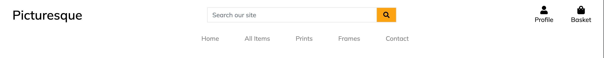
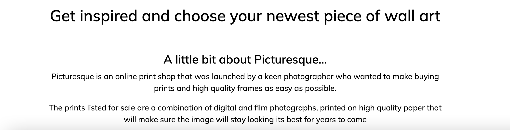
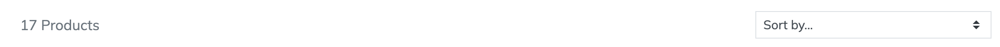
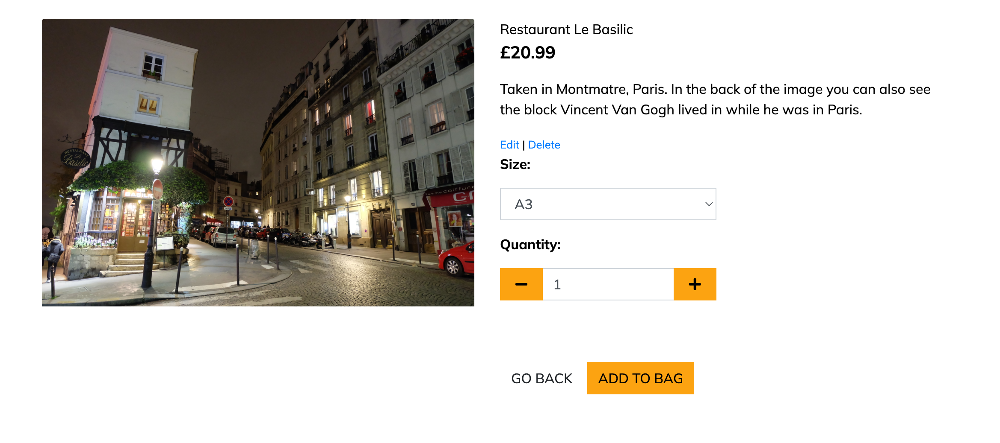
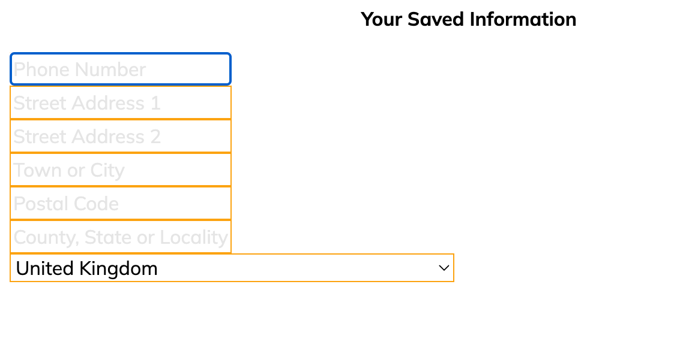
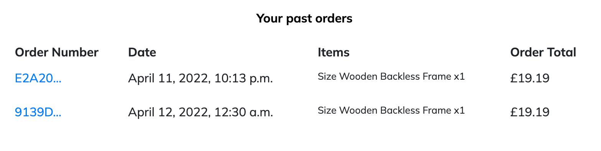
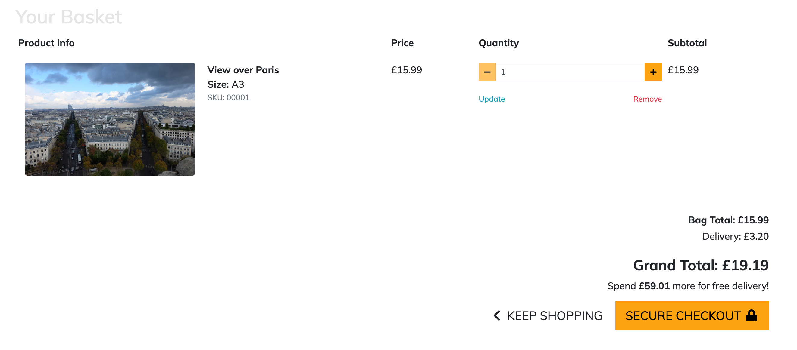
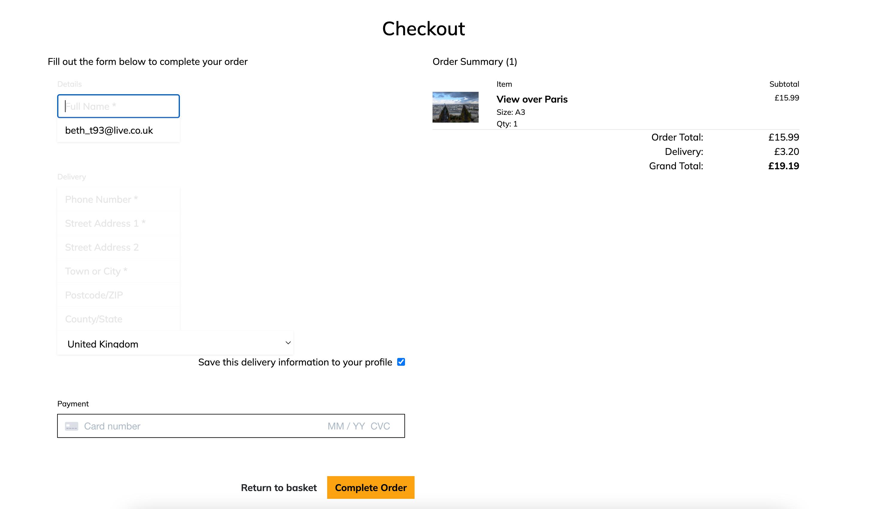
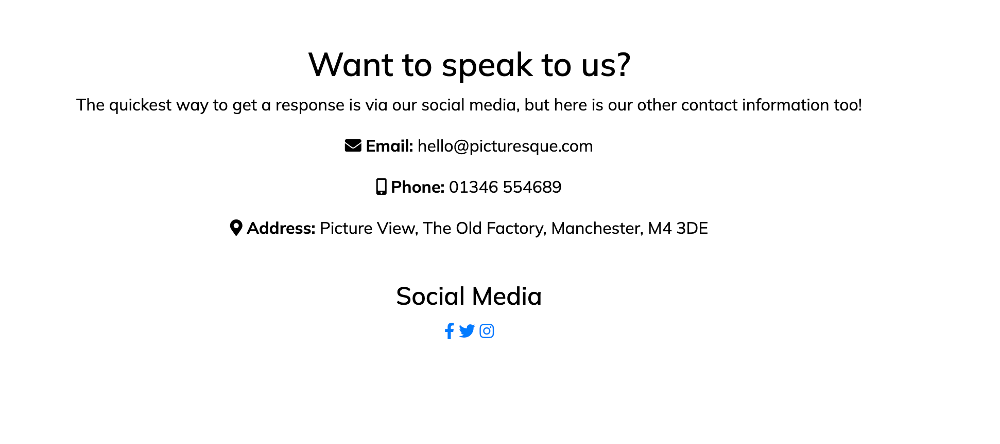

[View the deployed site here](https://picturesque-ms4.herokuapp.com/)

## Table of Contents

- [Project Goals](#project-goals)
- [User Experience](#user-experience)
    - [User Goals](#user-goals)
    - [Target Audience](#target-audience)
    - [User Stories](#user-stories)
    - [User Requirments and Expectations](user-requirements-and-expectations)
    - [Scope](#scope)
    - [Structure](#structure)
- [Design Choices](#design-choices)
    - [Colours](#colours)
    - [Fonts/Typography](#fonts-typography)
- [Wireframes](#wireframes)
- [Technologies Used](#technologies-used)
    - [Languages](#languages)
    - [Frameworks, Librabries and Other Tools](#frameworks-libraries-and-other-tools)
- [Features](#features)
- [Future Features](#future-features)
- [Information Architecture](#information-architecture)
- [Testing](#testing)
    - [Manual Testing](#manual-testing)
    - [Testing on Other Devices](#testing-on-other-devices)
    - [Testing of User Stories](#testing-of-user-stories)
- [Bugs](#bugs)
- [Deployment](#deployment)
- [Credits](#credits)
- [Acknowledgements](Acknowledgements)


## Project Goals
Picturesque is an online print shop for a photographer, it sells prints alongside frames. This easily allows people to completely transform their home with art while only having to shop in one place.

## User Experience
### User Goals
- An easy to use site
- Be able to easily purchase prints and frames
- Be able to create an account, add items to their basket and checkout
- Easily find Picturesque on their social media channels from the website


### Target Audience
- General public
- Art fans
- Photographers

### User Stories
#### Visitor Goals
1. As a visitor I want the site to be easy and simple to use.
2. As a visitor I want to be able to search for a product by name or description
3. As a visitor I would like to be able to sort products by name, price or category
4. As a visitor I would like to be able to add a product to my basket and checkout
5. As a visitor I would like to be able to see my order history
6. As a visitor I would like to be able to adjust the quantity of items in the basket
7. As a visitor I would like to receive an order confirmation after checkout
8. As a visitor I would like to receive an email confirmation of my order
9. As a visitor I would like to easily find Picturesque's contact information, social media and find out who they are

#### Site Owner Goals
10. As a site owner I want the site to be easy to use.
11. As a site owner I want the site to be clean and simple, allowing the products to stand out
12. As a site owner I want the purpose of the site to be clear to each user.
13. As a site owner I want to be able to add, edit and delete products in the store.

### User Requirements and Expectations
#### Requirements
- Easy to navigate
- Appealing design that allows the products to stand out
- The user will be able to purchase items, with an account, but also anonymously
- Users with an account will be able to store their contact and delivery information
- All users will be able to view the full range of products

#### Expectations
- Buttons take you to the page they say they will
- Add to basket will successfully add the item to basket
- Checkout will successfully take payment for the order
- The signup link will allow users to create an account
- Login will allow exisiting users to access their account, including their order history
- The user will receive feedback from the site when adding an item to basket, updating their basket and checking out


## Scope
Based on the above information, features to be included in the design include:
- An easy to navigate homepage with an obvious path to other pages
- A profile page that is only accessible to individual users when they log in
- Easily log in and logout of the site with the relevant buttons in the navigation bar
- A contact page with links to social media

## Structure
A responsive site consisitng of multiple pages, including home, products, contact, profile, log in and create account.

The site will be simple to use across all devices.

## Design Choices
The style of the site will be simple and minimal so it remains easy to navigate and allows the products to be the main selling point.

### Colours


I have chosen a colour scheme that is minimal, but still has a pop of colour to break up the black and white.
### Fonts/Typography
I have decided to use Mulish, taken from the Google Fonts library, with sans-serif being the fallback font should either of the selected fonts be unavailable. 

This font is clean and easy to read.

## Skeleton

## Surface

### Wireframes
- [Home - desktop](docs/wireframes/Home-desktop.png)
- [Home - mobile and tablet](docs/wireframes/Home-mobile.png)
- [Products - desktop](docs/wireframes/Products-desktop.png)
- [Products - mobile and tablet](docs/wireframes/Products-mobile.png)
- [Contact - desktop](docs/wireframes/Contact-desktop.png)
- [Contact - mobile and tablet](docs/wireframes/Contact-mobile.png)
- [Profile - desktop](docs/wireframes/Profile-desktop.png)
- [Profile - mobile and tablet](docs/wireframes/Profile-mobile.png)
- [Login - desktop](docs/wireframes/Login-desktop.png)
- [Login - mobile and tablet](docs/wireframes/Login-mobile.png)
- [Basket - desktop](docs/wireframes/Basket-desktop.png)
- [Basket - mobile and tablet](docs/wireframes/Basket-mobile.png)
- [Checkout - desktop](docs/wireframes/Checkout-desktop.png)
- [Checkout - mobile and tablet](docs/wireframes/Checkout-mobile.png)
- [Checkout Success - desktop](docs/wireframes/Checkout-Success-desktop.png)
- [Checkout Success - mobile and tablet](docs/wireframes/Checkout-Success-mobile.png)
- [Blog - desktop](docs/wireframes/blogpage-desktop.png)
- [Blog - mobile and tablet](docs/wireframes/blogpage-mobile.png)
- [Blog Post - desktop](docs/wireframes/blogpost-desktop.png)
- [Blog Post - mobile and tablet](docs/wireframes/blogpost-mobile.png)
## Technologies Used

### Languages
- [HTML5](https://en.wikipedia.org/wiki/HTML5)
- [CSS3](https://en.wikipedia.org/wiki/CSS)
- [Python](https://en.wikipedia.org/wiki/Python_(programming_language))
- [Javascript](https://en.wikipedia.org/wiki/JavaScript)


### Frameworks, Libraries and Other Tools
1. [Affinity Designer](https://affinity.serif.com/en-gb/designer/)
2. [Git](https://git-scm.com/)
3. [Github](https://github.com/)
4. [Am I Responsive](http://ami.responsivedesign.is/)
5. [Coolors](https://coolors.co/)
6. [Visual Studio Code](https://visualstudio.microsoft.com/)
7. [Balsamiq](https://balsamiq.com/)
8. [Font Awesome](https://fontawesome.com/)
9. [Google Fonts](https://fonts.google.com/)
10. [Bootstrap](https://getbootstrap.com/)
11. [Django](https://www.djangoproject.com/) 
12. [AWS](https://aws.amazon.com/?nc2=h_lg)
13. [Heroku](https://dashboard.heroku.com/login)
14. [Postgres](https://www.postgresql.org/)


## Features

#### Common Features
##### 1. Navigation and Page Header

- This is a feature that is seen on every page
- Each part is easy to read, and provides simple explanations of where each link will take you
- The search bar will search product names and descriptions
###### User stories covered by this feautre:
1. As a visitor I want the site to be easy and simple to use.
2. As a visitor I want to be able to search for a product by name or description
9. As a visitor I would like to easily find Picturesque's contact information and social media
10. As a site owner I want the site to be easy to use.
11. As a site owner I want the site to be clean and simple, allowing the products to stand out
12. As a site owner I want the purpose of the site to be clear to each user.

#### Feature 1 - Homepage
The homepage is made up of:
1. Image Carousel
2. A summary of Picturesque
##### 1. Image Carousel

- I used the Bootstrap component for this element
- It gives users a hint of the kind of images that are sold on the site
- It is eyecatching and will draw the users attention
###### User stories covered by this feautre:
11. As a site owner I want the site to be clean and simple, allowing the products to stand out

##### 2. A summary of picturesque

- This feature tells the user what Picturesque is
- The font is clear and easy to read 
###### User stories covered by this feautre:
9. As a visitor I would like to easily find Picturesque's contact information, social media and find out who they are
12. As a site owner I want the purpose of the site to be clear to each user.


#### Feature 2 - All Products Pages
- This page contains all of the products available to purchase
- There are two further pages that split the items into their respective category
- For superusers there is an option to edit or delete an item at the bottom of each listing

##### Product Filter

- This lets the user filter the products by name, price or category

###### User stories covered by this feautre:
3. As a visitor I would like to be able to sort products by name, price or category
13. As a site owner I want to be able to add, edit and delete products in the store.


#### Feature 3 - Product Details Page
- This page contains all the information about the product.
- There is the option to add the item to bag
- For superusers the option to edit or delete the item is on this page

##### Product Details

- This page is simple and easy to read
- The dropdown allows users to select the size print they would like to purchase
- The add to basket button allows users to add items to basket

###### User stories covered by this feautre:
4. As a visitor I would like to be able to add a product to my basket and checkout
13. As a site owner I want to be able to add, edit and delete products in the store.


#### Feature 4 - User Profile
- This page contains a simple form allowing users to add or update their saved delivery information
- It also allows users to see their order history

##### Saved Information and order history


- This table allows users with an account to save their delivery information for a faster checkout experience with any other orders

###### User stories covered by this feautre:
5. As a visitor I would like to be able to see my order history


#### Feature 5 - Basket Page
- This page allows users to proceed to checkout with their items

##### Item information and totals

- Users can easily adjust item quantities using the plus and minus buttons, or delete by using the delete button
- Users can clearly see how much their order will cost before and after delivery.

###### User stories covered by this feautre:
1. As a visitor I want the site to be easy and simple to use.
4. As a visitor I would like to be able to add a product to my basket and checkout
6. As a visitor I would like to be able to adjust the quantity of items in the basket


#### Feature 6 - Checkout Page
- This page allows users to checkout using stripe
- It allows the user to input their delivery and contact information
- Once completed there is a toast confirming the order, as well as email feedback

##### Checkout information and details

- This page is clean and easy to follow
- It shows the details of your order before you complete it
- There is instant feedback once the order is complete, as well as feedback via email

###### User stories covered by this feautre:
1. As a visitor I want the site to be easy and simple to use.
7. As a visitor I would like to receive an order confirmation after checkout
8. As a visitor I would like to receive an email confirmation of my order

#### Feature 7 - Contact Page
- This page allows users to find contact information for Picturesque

##### Checkout information and details

- This page contains all the contact information for Picturesque
- There are direct links to all social media channels

###### User stories covered by this feautre:
9. As a visitor I would like to easily find Picturesque's contact information, social media and find out who they are

## Future Features
In the future I would like to add the functionality to turn part of the site into a print on demand site, so users can then upload their own files to get printed.

I would also add customer reviews of each item.

## Information Architecture
### Data Storage
- User Information

| Title | Key In Database | Form Validation | Data Type |
|--------|--------|--------|--------|
| Account id | _id | No Validation | Primary Key |
| Full Name | full_name | max length 20 | CharField |
| E-mail Address | email | Must contain @ & .com etc | Email |
| Street Address | default_street_address1 | max length 128 | CharField |
| Street Address 2 | default_street_address2 | max length 128 | CharField |
| City Or Town | default_town_or_city | max length 128 | CharField |
| County/State | default_county | max length 64 | CharField |
| Postal Code | default_postcode | max length 12 | CharField |
| Contact Number | default_telephone_number | Number max length 20 | CharField |
| Country | country | pycountry select  | Option |

- Product information 

| Title              | Key In Database | Form Validation | Data Type |
|--------------------|-----------------|-----------------|-----------|
| Product Id         | _id             | No Validation   | Primary Key  |
| Product Name       | name            | max length 254 | CharField |
| Product Category   | category        | max length 100 | CharField |
| Price              | price           | Max Digits 6 Decimal Places 2 | DecimalField  |
| Category           | category          | No validation | ForeignKey |
| Description        | description     | No validation | CharField |
| Size              | has_sizes          | Default True | BooleanField |
| In Stock           | in_stock         | Default True | BooleanField |
| Image              | image           | Null True Blank True | ImageField |

- Orders Information

|     Title    | Key In Database |    Form Validation    |  Data Type  |
|--------|-----------|---------------------|-----------|
| Order Number | order_number | No Validation | Primary Key |
| User Profile | user_profile | text | Foreign Key |
| Full Name | full_name | max length 100 | CharField   |
| email | email | max length 100 | CharField   |
| telephone Number | telephone_number | max length 20 | CharField |
| street address 1| street_address1 | max length 100 | CharField |
| street address 2 | street_address2 | max length 100 | CharField |
| City Town    | town_or_city       | max length 100 | CharField   |
| County/State | county   | max length 100 | CharField   |
| Postcode Zip | postcode    | max length 8   | CharField   |
| Country      | country         | country select        | Option      |
| Order Date   | order_date      | datetime.date.today   | DateField   |
| Total Order   | total_order    | max digits 10   | DecimalField   |
| Delivery Charge | delivery_charge | max digits 5   | DecimalField   |
| Grand total  | grand_total     | max digits 10 | DecimalField    |


## Testing

### Manual Testing

#### **Navigation**

| **Element** | **Action**|  **Expected Result** |  **Pass/Fail** |
|---|---|---|---|
|  **Navbar** |   |   |   |
|  Logo/Site name | click  | redirect to home page  |  Pass |
|  Searchbar |  Enter a query | display products related to that query  |  Pass |
|  Searchbar Icon| click | submit query | Pass |
|  My Accout Icon dropdown | click  |  display a dropdow list |  Pass |
|  Register |  click |  redirect to sign up page | Pass   |
| Log in  |  click | redirect to sign in page    | Pass   |
| My Profile |  click |  redirect to my profile page | Pass   |
|   |   | (only when user is logged in)  | Pass  |
| Log out  | click  | Confirm log out page  | Pass  |
|   |   | (only when user is logged in)  | Pass  |
| Add Product  | click   |  redirect to add product page | Pass  |
|   |   | (only when superuser is logged in)  | Pass  |
| Bag Icon  | click  | redirect to bag page  | Pass  |
| **MainNav**  |   |   |   |
| Home |  click | redirect to home page   | Pass   |
| All Items  | click  | redirect to Products page showing all items  | Pass   |
| Prints  | click   | redirect to Products page showing items in the prints category  | Pass  |
| Frames |  click | redirect to Products page showing items in the frames category   |  Pass |
| Contact  | click   | redirect to contact page  | Pass |
| **MobileNav**  |   |   |   |
| Hamburger Icon  |  click | open mobile  | Pass  |
| Search Icon  | click  | open search bar as is on mainNav  |  Pass |
|  My Accout Icon dropdown | click  |  display a dropdow list |  Pass |
|  Register |  click |  redirect to sign up page | Pass   |
| Log in  |  click | redirect to sign in page    | Pass   |
| My Profile |  click |  redirect to my profile page | Pass   |
|   |   | (only when user is logged in)  | Pass  |
| Log out  | click  | Confirm log out page  | Pass  |
|   |   | (only when user is logged in)  | Pass  |
| Add Product  | click   |  redirect to add product page | Pass  |
|   |   | (only when superuser is logged in)  | Pass  |
| Bag Icon  | click  | redirect to bag page  | Pass  |
| Home |  click | redirect to home page   | Pass   |
| All Items  | click  | redirect to Products page showing all items  | Pass   |
| Prints  | click   | redirect to Products page showing items in the prints category  | Pass  |
| Frames |  click | redirect to Products page showing items in the frames category   |  Pass |
| Contact  | click   | redirect to contact page  | Pass |

### **Home Page**

All elements on this page are displayed and responsive

### **Contact Page**

| **Element** | **Action**|  **Expected Result** |  **Pass/Fail** |
|---|---|---|---|
| Social Media Icons  | click  | redirect users to the relevant page in a new tab  | Pass  |

### **All Items Page**

| **Element** | **Action**|  **Expected Result** |  **Pass/Fail** |
|---|---|---|---|
| Sorting bar  | click  | sort products by specific query  |  Pass |
| Product Image  | click  | redirect user to that specific product detail page   | Pass  |
| Back to Top button  | click  | pop the view back to the top of the page  | Pass  |
| *When a superuser logged in*  |   |   |   |
| Edit/Delete link shows  |   |   |   |
| Edit  | click  | redirect user to edit product page  | Pass  |
| Delete  | click  | a toast telling the user the product has been deleted appears  | Pass  |

### **Product Detail Page**

| **Element** | **Action**|  **Expected Result** |  **Pass/Fail** |
|---|---|---|---|
| Image  | Click  | open up the image in a seperate page  | Pass |
| Select Input/Size   | click  | shows the corresponding value   | Pass  |
| Add to bag  |  click |  add item to the shopping bag with the variation value and redirect to the bag page | Pass  |
| Go back button  | click  | redirect user to all products page  | Pass  |

### **Shopping Bag Page**

| **Element** | **Action**|  **Expected Result** |  **Pass/Fail** |
|---|---|---|---|
|**No bag items**  |   |   |   |
| Keep shopping button  | click  | redirect to all products page  | Pass  |
| **Bag items** |   |   |   |
| Toast message  | None  | pop up with a success message  | Pass  |
| Product name  | click  | redirect user to product detail page  | Pass  | 
|  Minus Button | click(when there are more than 1 such items in the bag)  | reduce the item quantity by 1, Toast sucess message shows with a shopping bag preview | Pass  |
|  Minus Button | click(when there is 1 such items in the bag)  | nothing, user cannot add negative values to the basket | Pass  |
| Plus Button | click  | increase the lineitem quantity by 1, toast success message shows up | Pass  |
| Update Button  | click  | Update all other values in the basket  | Pass  |
| Delete Button  | click  | a confirm deletion modal pops up  | Pass  |
|   | press ok  | delete the lineitem from the shopping bag  |   |
| Secure Checkout button  | click(user logged in)  | redirect to the checkout page(if save_info, form populated with user info) | Pass  |
| Secure Checkout button  | click(user  not logged in)  | redirect to the checkout page (blank form) | Pass  |
| Keep shopping button  | click  | redirect to all products page  | Pass  |

### **Checkout Page**

| **Element** | **Action**|  **Expected Result** |  **Pass/Fail** |
|---|---|---|---|
| Details and Delivery Form  | (if not logged in) Fill in  | on submit, data will be saved with the order  | Pass  |
| Details and Delivery Form  | (if logged in) Fill in  | form will be prepopulated if saved data available. On submit, data will be saved with the order  | Pass  |
| Create account link | (if not logged in) click  | will take user to signup page  | Pass  |
| Already have an account link | (if not logged in) click  | will take user to login page  | Pass  |
| Payment card input   | input invalid card number  | error message on field  | Pass  |
|   | input invalid card date  | erroor message on field  | Pass  |
|   | Onload (user not logged in)  | shown  |  Pass |


### **Checkout Success Page**

| **Element** | **Action**|  **Expected Result** |  **Pass/Fail** |
|---|---|---|---|
| Toast message  | None  | success messages  | Pass  |

## **Profile Page**

| **Element** | **Action**|  **Expected Result** |  **Pass/Fail** |
|---|---|---|---|
| Form fields  | Onload | fields populated with user default info(if previously saved)  | Pass  |
| All input fields  |  leave blank | on submit: form submit  |  Pass |
|   | just whitespace | leave blank  |  on submit: form submit |  Pass   |
|   | fill in correctly   | leave blank  |  on submit: form submit | Pass |
| Form dropdown  | click  | show dropdown options  | Pass  |
| Update button  | click  | Form submits  | Pass  |
|   |   | Form updated toast message appears  | Pass  |
| Previous order number  | click  | redirect to previous order checkout success page  | Pass  |

### **Previous Order checkout success page**

| **Element** | **Action**|  **Expected Result** |  **Pass/Fail** |
|---|---|---|---|
| Toast message  | Onload | alert message inform the user this is a previous order  | Pass  |
| Back to profile Button  | click  | redirect to profile page  | Pass  |

### **Product Admin - Add product Page**

| **Element** | **Action**|  **Expected Result** |  **Pass/Fail** |
|---|---|---|---|
| Category Form dropdown  | click  | display all categories  | Pass  |
| SKU Text input  | Fill in | display all categories  | Pass  |
| Name Form Text Input (if required)  |Leave blank|On Submit: Warning appears, form won't submit |Pass  |
| Name Form Text Input (if required)  |Fill In    |On Submit: Form submit          |Pass  |
| Description Text Field | Fill in | On Submit: Form submit | Pass |
| Has Sizes Dropdown | Select Option | On Submit: Form submit | Pass |
| Price Form Text Input (if required)  |Leave blank|On Submit: Warning appears, form won't submit |Pass  |
| Price Form Text Input (if required)  |Fill In    |On Submit: Form submit          |Pass  |
| Image select button | click | Add image to product | Pass |
| Cancel Button | click | send user back to all  products without saving any changes | Pass |
| Add to site Button | click | Saves new item and redirects to the products page | Pass |

### **Product Admin - Edit product Page**

| Element                       | Action    | Expected Result                | Pass/Fail |
|-------------                 |----------|-----                          |-----|
|All form fields                |On load    |Populated with original values  |Pass  |
|Form Dropdowns             |Click      |Show dropdown options           |Pass  |
|Name Text Input (if required)  |Leave blank|On Submit: Warning appears, form won't submit |Pass  |
|Name Text Input (if required)  |Fill In    |On Submit: Form submit          |Pass  |
| Price Form Text Input (if required)  |Leave blank|On Submit: Warning appears, form won't submit |Pass  |
| Price Form Text Input (if required)  |Fill In    |On Submit: Form submit          |Pass  |
|Form image Select button       |Click      |Open device storage             |Pass  |
|                               |           |New image name displayed        |Pass  |
|Cancel button                  |Click      |Redirect to products page       |Pass  |
|Update Product button(form valid)|Click    |Form submit                     |Pass  |
|                               |           |Redirect to product detail page |Pass  |
|                               |           |Product updated toast appears   |Pass  |
|Update Product button(form invalid)|Click  |Form doesn't submit             |Pass  |
|                               |           |Error messages on invalid fields|Pass  |

### **Alluth Pages**

| Element                   | Action | Expected Result                   | Pass/Fail |
|:-------------             |:-------|:---------------------------------------|:-----|
|**Register**               |        |                                        |      |
|Sign in link               |Click   |Redirect to sign in page                |Pass  |
|*Form*                     |        |                                        |      |
|Email field        |Fill in<br>(incorrect format)|On submit: form wont'submit|Pass  |
|                           |        |Error message on invalid field          |Pass  |
|                          |Fill in<br>(correct format)|On submit: form submit|Pass  |
|                 |Fill in<br>(email already used)|On submit: form wont'submit|Pass  |
|                           |        |Error message on invalid field          |Pass  |
|                  |Fill in<br>(email not already used)|On submit: form submit|Pass  |
|Username field       |Fill in<br>(all whitespace)|On submit: form wont'submit|Pass  |
|                           |        |Error message on invalid field          |Pass  |
|                          |Fill in<br>(correct format)|On submit: form submit|Pass  |
|              |Fill in<br>(username already used)|On submit: form wont'submit|Pass  |
|                           |        |Error message on invalid field          |Pass  |
|               |Fill in<br>(username not already used)|On submit: form submit|Pass  |
|Password field         |Fill in<br>(incorrect format)|On submit: form wont'submit|Pass  |
|                       |            |error message on invalid field          |Pass  |
|                     |Fill in<br>(correct format)|On submit: form wont'submit|Pass  |
|              |Fill in<br>(passwords don't match)|On submit: form wont'submit|Pass  |
|                           |        |error message on invalid field          |Pass  |
|                         |Fill in<br>(passwords match)|On submit: form submit|Pass  |
|Sign Up button(form invalid)|Click  |Form wont'submit                        |Pass  |
|                           |        |error message on invalid fields         |Pass  |
|Sign Up button(form valid) |Click   |Form submit                             |Pass  |
|                           |        |redirect to email verification page     |Pass  |
|                           |        |email sent to user                      |Pass  |
|**Email Verification**     |        |                                        |      |
|Follow link from email     |Click   |redirect to confirm email page          |Pass  |
|Confirm button             |Click   |redirect to log in page                 |Pass  |
|                           |        |sign in form populated with user info   |Pass  |
|                           |        |email confirmation toast appears        |Pass  |
|**Login**                  |        |                                        |      |
|Sign up link               |Click   |Redirect to sign up page                |Pass  |
|*Form*                     |        |                                        |      |
|Username Field     |Fill in<br>(just whitespace)|On submit:form won't submit |Pass  |
|                           |        |error message on invalid field          |Pass  |
|                    |Fill in<br>(wrong username)|On submit:form won't submit |Pass  |
|                           |        |error message for username/password     |Pass  |
|Password Field     |Fill in<br>(just whitespace)|On submit:form won't submit |Pass  |
|                           |        |error message on invalid field          |Pass  |
|                    |Fill in<br>(wrong password)|On submit:form won't submit |Pass  |
|                           |        |error message for username/password     |Pass  |
|Forgot Password button     |Click   |redirect to password reset page         |Pass  |
|Sign In button(form invalid)|Click  |form won't submit                       |Pass  |
|                           |        |error message on invalid field(s)       |Pass  |
|Sign In button(form valid) |Click   |form submit                             |Pass  |
|                           |        |redirect to home page                   |Pass  |
|                           |        |sign in confirmation toast appears      |Pass  |
|**Password Reset**         |        |                                        |      |
|Email Field        |Fill in<br>(just whitespace)|On submit:form won't submit |Pass  |
|                           |        |error message on invalid field          |Pass  |
|                |Fill in<br>(incorrect email)|On submit:form won't submit    |Pass  |
|                           |        |error message on invalid field          |Pass  |
|                           |Fill in<br>(correct email)|On submit:form submit |Pass  |
|Forgot Password button     |Click   |redirect to password reset page         |Pass  |
|Reset password button(form invalid)|Click  |form won't submit                |Pass  |
|                           |        |error message on invalid field          |Pass  |
|Reset password button(form valid)|Click  |form submit                        |Pass  |
|                           |        |redirect to password reset confirmation |Pass  |
|                           |        |email sent to user                      |Pass  |
|**Change Password**        |        |                                        |      |
|Password reset link from email|Click|redirect to change password page        |Pass  |
|Password input     |Fill in<br>(all whitespace)|On submit: form won't submit |Pass  |
|                           |        |error message on field                  |Pass  |
|           |Fill in<br>(passwords not matching)|On submit: form won't submit |Pass  |
|                           |        |error message on field                  |Pass  |
|                        |Fill in<br>(passwords match)|On submit: form submit |Pass  |
|Change password button(form invalid)|Click|Redirect to change password confirmation|Pass  |
|                           |      |Password change confirmation toast appears|Pass  |
|**Logout Confirmation**    |        |                                        |      |
|Sign out button            |Click   |Redirect to homepage                    |Pass  |
|                           |        |Sign out confirmation toast appears     |Pass  |
### Testing on other devices

#### Devices tested:
- IPhone 12 Pro
- Samsung Galaxy s20+
- IPad Pro 11"
- 21.5" IMac
- Asus Chromebook Flip C434TA

#### Browser Testing
- Chrome
- Brave (Chromium)
- Safari


### Testing User Stories

1. As a visitor I want the site to be easy and simple to use.
    
    | Feature | Action | Expected Result | Actual Result |
    | ------- | ------ | --------------- | ------------- |
    | Simple, easy to use design | User is able to navigate to all parts of the site | find and purchase products | Works as expected |

2. As a visitor I want to be able to search for a product by name or description
    
    | Feature | Action | Expected Result | Actual Result |
    | ------- | ------ | --------------- | ------------- |
    | Search bar in main navigation | User can enter search term and it will search product names and descriptions | Users can quickly find items by name or description | Works as expected |

3. As a visitor I would like to be able to sort products by name, price or category

    | Feature | Action | Expected Result | Actual Result |
    | ------- | ------ | --------------- | ------------- |
    | Filter dropdown on all product pages | User selects filter option | Products will display as directed by the filter | Works as expected |

4. As a visitor I would like to be able to add a product to my basket and checkout

    | Feature | Action | Expected Result | Actual Result |
    | ------- | ------ | --------------- | ------------- |
    | Add to bag button on product details page | User clicks button | Product is added to basket, and toast appears telling the user the item has been added | Works as expected |
    | Checkout button in Basket | User clicks button | User is taken to checkout page, where they can add their details and get the order processed. | Works as expected

5. As a visitor I would like to be able to see my order history

    | Feature | Action | Expected Result | Actual Result |
    | ------- | ------ | --------------- | ------------- |
    | Order history on profile page | User goes to profile page | All order history is listed, clicking the order number takes you to that order confirmation with feedback telling you when the confirmation email was sent | Works as expected |

6. As a visitor I would like to be able to adjust the quantity of items in the basket

    | Feature | Action | Expected Result | Actual Result |
    | ------- | ------ | --------------- | ------------- |
    | plus and minus quantity buttons in the basket | Click | The quantity can be updated with values between 1 and 99 | Works as expected |

7. As a visitor I would like to receive an order confirmation after checkout
8. As a visitor I would like to receive an email confirmation of my order

    | Feature | Action | Expected Result | Actual Result |
    | ------- | ------ | --------------- | ------------- |
    | Order confirmation page | User checks out their order | Page with all the order details and a message saying an email has been sent opens |  Works as expected|

9. As a visitor I would like to easily find Picturesque's contact information, social media and find out who they are

    | Feature | Action | Expected Result | Actual Result |
    | ------- | ------ | --------------- | ------------- |
    | Navigate to the contact page | click | Contact page with all contact info and links to social media opens | Works as expected |


10. As a site owner I want the site to be easy to use

    | Feature | Action | Expected Result | Actual Result |
    | ------- | ------ | --------------- | ------------- |
    | Simple, easy to use design | User is able to navigate to all parts of the site | find and purchase products | Works as expected |

11. As a site owner I want the site to be clean and simple, allowing the products to stand out

    | Feature | Action | Expected Result | Actual Result |
    | ------- | ------ | --------------- | ------------- |
    | Simple, easy to use design, and muted colour scheme | User is able to easily see the products | find and purchase products | Works as expected |

12. As a site owner I want the purpose of the site to be clear to each user.

    | Feature | Action | Expected Result | Actual Result |
    | ------- | ------ | --------------- | ------------- |
    | Homepage with some company information | The user is able to see this information when they open the page | know the purpose of the site | Works as expected |

13. As a site owner I want to be able to add, edit and delete products in the store.

    | Feature | Action | Expected Result | Actual Result |
    | ------- | ------ | --------------- | ------------- |
    | Add products link in profile dropdown  | Superusers are able to click this link | Be taken to the add product page | Works as expected |
    | Edit product button | Superusers can see this for each item, either in the all products view or the product details view | Be taken to the edit product page | Works as expected |
    | Edit product button | Superusers can see this for each item, either in the all products view or the product details view | Delete an item | Works as expected |
    
## Bugs
- Bug : Products not showing
- Fix: move products.html into the correct subfolder

- Bug: Product detail page blank
- Fix: fix spelling error in code linking to views.py

- Bug: Sort by category filter error
- Fix: change sortkey from category_name to category in views.py

- Bug: Stripe payments not going through
- Fix: Adding Webhook secret to Heroku config vars and .env file


## Deployment
### Github Pages
This site is deployed using GitHub pages, this was the process:
1. Logged in and selected my MS4 repository
2. Go to settings in the repository
3. Go to 'Pages" in the menu
4. Click 'source'
5. Change to dropdown menu from 'none' to 'main'
6. Click the link to the deployed site once the page has reloaded

### Forking this Repository
1. Find the repository on GitHub
2. Click the 'Fork' button on the top right of the page
3. You will now have a copy of the repository on your Github account

### Cloning this Repository
1. Find the repository on Github
2. Click on 'Code'
3. To clone using HTTPS - copy the url
4. Open Git and go to the directory you want to become the cloned directory
5. In the terminal type 'git clone' and the url
6. Press enter for the clone to be created.

### Deploying to Heroku
1. In the workspace terminal, run pip3 freeze --local > requirements.txt to collect any dependencies.
2. Run python app.py > Procfile to create a Procfile required for Heroku deployment.
3. Go to the Heroku website. Register for an account and click on "Create a new app".
4. Setup a Heroku app within the Heroku dashboard - Type in the app name and select region the click on create app.
5. In Heroku, in your app, click on "GitHub" to connect to your repository. Type in the repository name as on GitHub. Click on "Connect".
6. Search for your repo (or sign in and connect GitHub account) and select this.
7. In the 'settings tab, click 'Reveal Config Vars' and input your environment variable from your local build in the key/value inputs.
8. Then click "Hide Config Vars" in Heroku.
9. In Heroku, select 'Automatic Deploys' to automatically rebuild the app when a new Git commit is pushed.
10. Once the initial build is complete, click 'Open App' in the top right of the screen to view the application.

### Setting up an S3 Bucket

1. Create an [Amazon AWS](https://aws.amazon.com/?nc2=h_lg) account
2. Search for **S3** and create a new bucket that matches your Heroku app name(picturesque)
- uncheck block all public access box
- check "I acknowledge that the current settings might result in this bucket and the objects within becoming public."
3. Under **Properties > Static**website hosting
- enable
- index.html as Index document
- error.html as Error document
- save
4. Under **Permissions > CORS** use:

```
[
  {
      "AllowedHeaders": [
          "Authorization"
      ],
      "AllowedMethods": [
          "GET"
      ],
      "AllowedOrigins": [
          "*"
      ],
      "ExposeHeaders": []
  }
]
```

5.Under **Permissions > Bucket** Policy:
- Generate Bucket Policy and take note of **Bucket ARN**
- Chose **S3 Bucket Policy** as Type of Policy
- For **Principal**, enter *
- Actions **Get Object** and **Put Object**
- Enter **ARN** noted above
- **Add statement**
- **Generate policy**
- Copy the **policy JSON Document** paste into **Edit bucket policy**
- Add a /* onto the end of the **resource key**
- Save changes
6. Under **Access Control List (ACL)**:
- For **Everyone (public access)**, tick **List**
- Accept that everyone in the world may access the Bucket
- Save changes

### Setting up AWS IAM

1. From the **IAM dashboard** within **AWS**, select User Groups:
- Create new group e.g. picturesque
- Click through without adding a policy
- **Create Group**
2. Select **Policies**:
- Create policy
- Under **JSON** tab, click **Import managed policy**
- Choose **AmazongS3FullAccess**
- Edit the resource to include the Bucket ARN noted earlier when creating the Bucket Policy:

```
                "Resource": [
			                "arn:aws:s3:::picturesque",
			                "arn:aws:s3:::picturesque/*"
                ]
```

- Click **next step** and go to **Review policy**
- Give the policy a name e.g. picturesque and description
- **Create Policy**
3. Go back to **User Groups** and choose the group created earlier
- Under **Permissions > Add permissions**, choose **Attach Policies** and select the one just created
- **Add Permissions**
4. Under **Users:**
- Choose a user name e.g. picturesque-staticfiles-user
- Select **Programmatic access** as the **Access type**
- Click Next
- Add the user to the Group just created
- Click Next and **Create User**
5. **Download the .csv containing the access key and secret access key. This will NOT be available to download again**

### Connecting Django to S3

1. Install boto3 and django-storages

```
pipenv install boto3
pipenv install django-storages
pip freeze > requirements.txt
```

2. Add 'storages' to settings.py ` INSTALLED_APPS`
3. Go to settings.py and set the bucket config, 

```
if "USE_AWS" in os.environ:
    # Bucket Config
    AWS_STORAGE_BUCKET_NAME = "picturesque"
    AWS_S3_REGION_NAME = "eu-west-1"
    AWS_ACCESS_KEY_ID = os.environ.get("AWS_ACCESS_KEY_ID")
    AWS_SECRET_ACCESS_KEY = os.environ.get("AWS_SECRET_ACCESS_KEY")
    AWS_S3_CUSTOM_DOMAIN = f"{AWS_STORAGE_BUCKET_NAME}.s3.amazonaws.com"
```

4. Add the values from the **.csv** you downloaded to your Heroku Config Vars under Settings:

```
AWS_ACCESS_KEY_ID
AWS_SECRET_ACCESS_KEY
USE_AWS=True
```
5. Delete the `DISABLE_COLLECTSTATIC` variable from your Config Vars and deploy your Heroku app

6. Create custom_storage.py with code below:

```
from django.conf import settings
from storages.backends.s3boto3 import S3Boto3Storage
class StaticStorage(S3Boto3Storage):
    location = settings.STATICFILES_LOCATION
class MediaStorage(S3Boto3Storage):
    location = settings.MEDIAFILES_LOCATION
```

7. Go to settings.py, set the static and media files storage and location and override static and media urls in production:

```
# Static and media files
STATICFILES_STORAGE = "custom_storages.StaticStorage"
STATICFILES_LOCATION = "static"
DEFAULT_FILE_STORAGE = "custom_storages.MediaStorage"
MEDIAFILES_LOCATION = "media"
# Override static and media URLs in production
STATIC_URL = f"https://{AWS_S3_CUSTOM_DOMAIN}/{STATICFILES_LOCATION}/"
MEDIA_URL = f"https://{AWS_S3_CUSTOM_DOMAIN}/{MEDIAFILES_LOCATION}/"
```

8. With your S3 bucket now set up, you can create a new folder called media (at the same level as the newly added static folder) and upload any required media files to it, making sure they are publicly accessible under **Permissions**

9. Add stripe keys in Config Vars in heroku, making sure the name matches settings.py

10. Add stripe webhook endpoint with the deployed site url:

```
https://picturesque-ms4.herokuapp.com/wh/
```
11. Get the new `STRIPE_WH_SECRET` and added it to the config vars.

12. Now your site is fully deployed.


## Credits
### Content and Media
- The Frame images all came from [Pexels](https://www.pexels.com/)
    - Frame 1 - Angela Roma
    - Frame 2 - Ann Poan
    - Frame 3 - Cottonbro
    - Frame 4 - Karolina Grabows
    - Frame 5 - Nadezhda Moryak
    - Frame 6 - PNW Production
    - Frame 7 - Polina Kovalev
    - Frame 8 - Tom Swinnen
    - Frame 9 - Eva Elijas
- All other images on the site are taken by me
- The text on the site was written by me

### Code
- [Bootstrap](https://getbootstrap.com/) for carousel and short hand margin/padding code

## Acknowledgements
- To my mentor, Richard Wells for supporting me in completing this project.
- To my partner for assistance in testing.